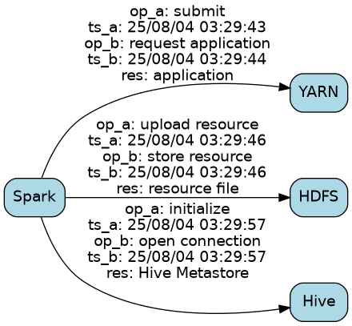

# Distributed-Services-Dependency-Discovery-from-Log

This project explores using LLM-based agents combined with temporal analysis to automatically discover, visualize, and reason about service dependencies from log data. Once the dependency graph is reconstructed, the system can further support incident analysis by tracing anomaly propagation patterns—identifying how failures cascade through the service topology and revealing the likely propagation paths from root cause to downstream impact.

## Setup

```bash
python3.11 -m venv .venv
source .venv/bin/activate
pip install -r requirements.txt
```

Set your OpenAI API key in `.env`:

```
OPENAI_API_KEY=sk-...
```

## Run

```bash
bash run.sh
# or manually:
python src/main.py -i log/spark-21714.log
```

Output files are written to `output/`:
- `*_interactions.json` — extracted service interactions
- `*_dependency_graph.png` — visualized dependency graph
- `*_dependency_graph.dot` — Graphviz DOT source

## Example (`log/spark-21714.log`)

**Dependency graph** (`output/spark-21714_dependency_graph.png`):



**Extracted interactions** (`output/spark-21714_interactions.json`):

| service_a | op_a | ts_a | service_b | op_b | ts_b | resource |
|-----------|------|------|-----------|------|------|----------|
| Spark | submit | 03:29:43 | YARN | request application | 03:29:44 | application |
| Spark | upload resource | 03:29:46 | HDFS | store resource | 03:29:46 | resource file |
| Spark | initialize | 03:29:57 | Hive | open connection | 03:29:57 | Hive Metastore |
